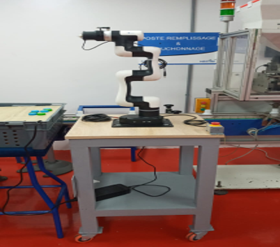
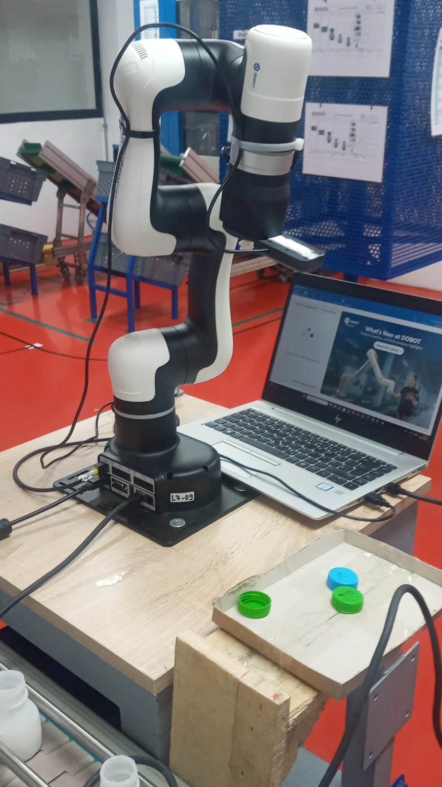
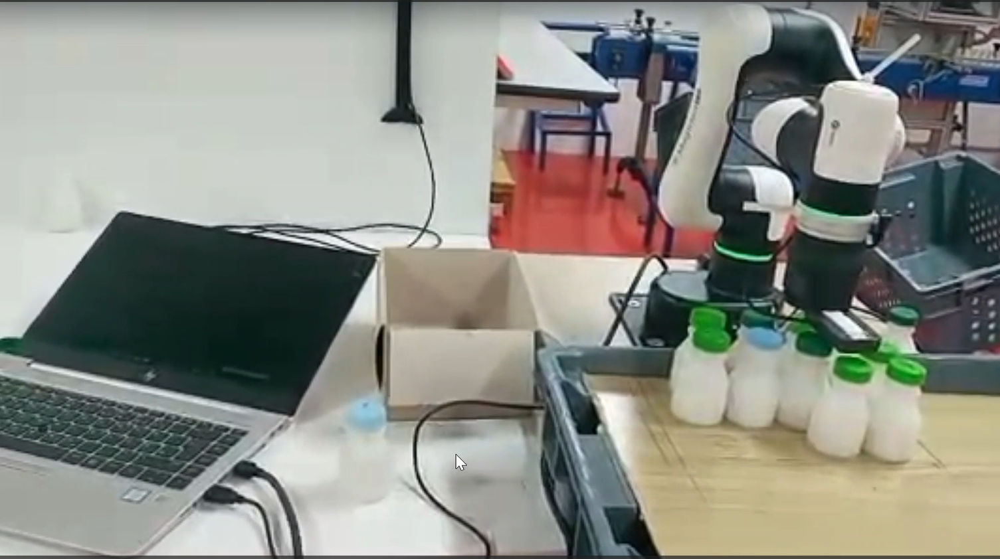

# 🤖 Remplissage automatique de carton avec le robot Dobot Magician E6

Ce dépôt documente un scénario de robotique réalisé dans le cadre d'un stage : un robot **Dobot Magician E6**, équipé d'une ventouse et guidé par une caméra, détecte des bouteilles (identifiées par la couleur de leur bouchon) et les range automatiquement dans un carton, emplacement par emplacement.

Ce guide a pour but de permettre à **n'importe qui** de reproduire le scénario, étape par étape : câblage du robot, installation du logiciel, installation des bibliothèques Python, et enfin exécution du code complet.

---

## 📋 Sommaire

1. [Câblage et installation matérielle du robot](#-étape-1--câblage-et-installation-matérielle-du-robot)
2. [Installation du logiciel DobotStudio Pro](#-étape-2--installation-du-logiciel-dobotstudio-pro)
3. [Installation des bibliothèques Python](#-étape-3--installation-des-bibliothèques-python)
4. [Explication du scénario / code complet](#-étape-4--explication-globale-du-scénario)
5. [Structure du dépôt](#-structure-du-dépôt)
6. [Lancer le scénario](#-lancer-le-scénario)

---

## 🔧 Étape 1 — Câblage et installation matérielle du robot

### 1.1 Fixation mécanique sur la plateforme
Avant toute mise sous tension, le robot **Dobot Magician E6** doit être solidement fixé sur son support/plateforme de travail.
- Positionner la base du robot sur la plateforme prévue à cet effet.
- Fixer la base à l'aide des vis fournies (4 points de fixation généralement) pour éviter tout mouvement ou vibration pendant le fonctionnement.
- Vérifier que le robot est bien stable et à niveau avant de continuer.



### 1.2 Connexion électrique

**a) Alimentation**
- Brancher le câble d'alimentation fourni dans le port d'alimentation situé à la base du robot.
- Brancher l'autre extrémité sur une prise secteur (220V).
- Appuyer sur le bouton power situé à la base : l'anneau lumineux du robot s'allume (le voyant passe généralement de l'orange/jaune au vert une fois le robot prêt, après quelques secondes de démarrage).

**b) Câble Ethernet (communication PC ↔ Robot)**
- Relier le port Ethernet du robot (à la base) au PC de contrôle à l'aide d'un câble réseau RJ45.
- Le robot dispose d'une adresse IP par défaut : **`192.168.5.1`**.
- Configurer une IP statique sur le PC dans le même sous-réseau (ex : `192.168.5.2`, masque `255.255.255.0`) pour pouvoir communiquer avec le robot.



> ⚠️ **Important** : le robot doit être complètement démarré (voyant vert stable) avant de tenter une connexion logicielle ou une communication TCP.

---

## 💻 Étape 2 — Installation du logiciel DobotStudio Pro

DobotStudio Pro est le logiciel officiel permettant de piloter, calibrer et programmer le Dobot Magician E6.

1. **Télécharger** DobotStudio Pro depuis le site officiel : [dobot-robots.com](https://www.dobot-robots.com) → section téléchargements → choisir la version compatible **Magician E6**.
2. **Installer** le logiciel en exécutant le fichier `.exe` téléchargé (Windows) — suivre l'assistant d'installation par défaut.
3. **Lancer** DobotStudio Pro.
4. **Connecter au robot** :
   - Une fois le robot allumé et relié en Ethernet, ouvrir DobotStudio Pro.
   - Saisir l'IP du robot (`192.168.5.1`) dans l'interface de connexion.
   - Cliquer sur **Connect** — le statut doit passer à "connecté".


### 2.1 Vérification des axes et calibration du point zéro
- Dans DobotStudio Pro, vérifier que les 6 axes répondent correctement au jog manuel.
- Effectuer la calibration "Home" (retour position zéro) pour s'assurer que le robot est bien référencé avant toute programmation.


### 2.2 Test rapide (cycle de test)
Avant de passer au code Python, il est recommandé de valider le bon fonctionnement du robot avec un cycle simple directement dans DobotStudio Pro (déplacement → préhension → relâchement).



---

## 🐍 Étape 3 — Installation des bibliothèques Python

### 3.1 Prérequis
- Python **3.8 ou supérieur** installé sur le PC de contrôle.

```bash
python --version
```

### 3.2 Bibliothèques utilisées

| Bibliothèque | Rôle dans le projet |
|---|---|
| `opencv-python` (`cv2`) | Capture vidéo, détection des bouchons par couleur, calcul d'homographie caméra→robot |
| `numpy` | Calculs matriciels (homographie, coordonnées) |
| `DobotTCP` | Pilotage du robot Dobot Magician E6 via le protocole TCP/IP (connexion, mouvements, pompe à vide) |
| `multipledispatch` | Dépendance requise par `DobotTCP` |
| `math`, `time` | Modules standards Python (aucune installation nécessaire) |

### 3.3 Installation

```bash
pip install -r requirements.txt
```

> 💡 Il est recommandé de créer un environnement virtuel avant l'installation :
> ```bash
> python -m venv venv
> venv\Scripts\activate
> pip install -r requirements.txt
> ```

### 3.4 Vérification
```bash
python -c "import cv2, numpy, DobotTCP; print('Toutes les bibliothèques sont installées ✓')"
```

---

## 🤖 Étape 4 — Explication globale du scénario

Le script Python réalise un cycle complet de **pick-and-place** guidé par vision, pour ranger des bouteilles dans un carton.

1. **Connexion et Home** : le robot se connecte via TCP/IP (`192.168.5.1:29999`), s'active, puis retourne à sa position d'origine (Home).
2. **Position caméra + détection** : le robot se déplace au-dessus de la zone de travail. La caméra capture une image et détecte les bouchons (verts ou bleus) par analyse de couleur (HSV) et de forme. Chaque bouchon détecté est converti de coordonnées pixels → coordonnées robot (mm) grâce à une **homographie** calibrée au préalable avec 6 points de référence.
3. **Tri par priorité** : les bouteilles détectées sont triées par distance croissante depuis la position actuelle du robot, pour optimiser le trajet.
4. **Confirmation visuelle** : une image annotée (avec l'ordre de traitement ID1, ID2…) s'affiche, puis le cycle démarre.
5. **Boucle Pick-and-Place** (répétée pour chaque bouteille détectée) :
   - Approche au-dessus de la bouteille
   - Descente et activation de la pompe à vide (aspiration)
   - Remontée puis passage par une position de sécurité
   - Déplacement vers l'emplacement correspondant dans le carton (12 emplacements prédéfinis, grille 4×3)
   - Désactivation de la pompe → dépose de la bouteille
   - Retour à la position de sécurité avant la bouteille suivante
6. **Fin de cycle** : une fois toutes les bouteilles placées (max. 12), le robot retourne en position Home.

### Points clés à retenir
- La **calibration** (points caméra ↔ points robot, positions du carton) a été faite manuellement et est propre à l'installation ; elle doit être refaite si la caméra, le carton ou le robot changent de position.
- Le code fonctionne en **boucle fermée simple** : détection → tri → exécution séquentielle, sans replanification dynamique en cours de cycle.

---

## 📁 Structure du dépôt

```
.
├── README.md                              # Ce guide
├── requirements.txt                       # Dépendances Python
├── .gitignore
├── scénario_remplissage_carton.py         # Code complet du scénario
├── image.png                              # Photo : fixation mécanique
├── cablage-du-robot.jpeg                  # Photo : connexion électrique + Ethernet
├── connexion-DobotStudio.png              # Photo : connexion logicielle DobotStudio Pro
├── étalonnage.jpeg                        # Photo : calibration / vérification des axes
└── image-testS1.png                       # Photo : cycle de test
```

---

## ▶️ Lancer le scénario

Une fois le robot câblé, DobotStudio Pro installé, et les bibliothèques Python installées :

```bash
python scénario_remplissage_carton.py
```

⚠️ Avant l'exécution, vérifier/adapter dans le code :
- `ROBOT_IP` : adresse IP du robot
- `PTS_CAMERA` / `PTS_ROBOT` : points de calibration homographie (propres à votre installation caméra/robot)
- `CARTON_SLOTS` : positions des 12 emplacements dans le carton (propres à votre carton et sa position)
- `CAMERA_INDEX` : index de la caméra utilisée

---

## 📌 Notes

- Projet réalisé dans le cadre d'un stage.
- Ce dépôt est destiné à aider toute personne souhaitant tester ou reproduire ce scénario de robotique.
